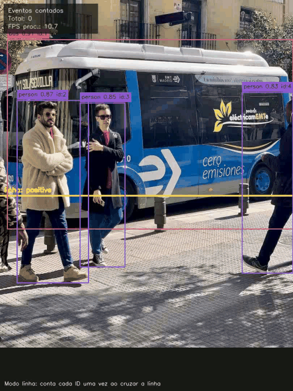

# Contador Inteligente de Objetos com OpenCV e YOLO

Projeto de visão computacional para detectar e contar **pessoas e veículos** em imagens e vídeos. A solução usa YOLO como detector, OpenCV para leitura e exportação de mídia, e gera uma saída visual com bounding boxes, labels, confiança, contagem por classe e métricas básicas de desempenho.

> Status: MVP técnico em evolução. O projeto já possui estrutura, CLI, módulos principais, interface, testes, contagem por frame, contagem por linha, tracking por centroide ou ByteTrack, filtro por ROI, ROI desenhável em imagem/vídeo, comparação entre execuções, comparação de modelos YOLO, relatórios Markdown/HTML, batch de imagens, otimizador de confidence/IOU, página de treinamento customizado, GIF de demonstração, Dockerfile e avaliação manual com amostras reais. O domínio definido é pessoas e veículos.



Demo rápida já disponível:

- Entrada: `data/samples/bus.jpg`
- Saída processada: `reports/figures/bus_processado.jpg`
- Resumo: `reports/figures/bus_processado.json`
- Resultado observado: `1 bus` e `3 person`
- Saída com ROI: `reports/figures/bus_roi_processado.jpg`
- Resultado com ROI observado: `1 bus` e `2 person`

Demo de vídeo:

- Entrada gerada: `data/samples/bus_demo.mp4`
- Saída processada: `reports/videos/bus_demo_line.mp4`
- CSV por frame: `reports/videos/bus_demo_line.csv`
- Resumo: `reports/videos/bus_demo_line.json`
- GIF: `reports/videos/demo.gif`
- Resultado observado no modo linha: `1 bus`, `3 person`, total `4`

Avaliação manual inicial:

- Anotações: `data/annotations/counts.csv`
- Relatório por classe: `reports/evaluation/counts_report.csv`
- Análise de erros: `reports/evaluation/error_analysis.csv`
- Resumo das métricas: `reports/evaluation/counts_summary.json`
- Anotações de segmentação/pose: `data/annotations/segmentation_pose.csv`
- Relatório de segmentação/pose: `reports/evaluation/segmentation_pose_report.csv`
- Análise comentada de segmentação/pose: `reports/evaluation/segmentation_pose_error_analysis.csv`
- Busca de parâmetros: `reports/evaluation/threshold_search.csv`
- Comparação de modelos: `reports/evaluation/model_comparison.csv`
- Melhor configuração atual após anotações ampliadas: `confidence=0.25`, `iou=0.70`
- Resultado atual antes da otimização: erro absoluto total `30`, MAE `7.50`, acerto exato `50%`
- Resultado após otimização: erro absoluto total `22`, MAE `5.50`, falsos positivos `5`, falsos negativos `17`
- Melhor modelo no conjunto atual: `yolov8n.pt`

Amostras reais adicionadas:

- `data/samples/real_traffic_bus_france.jpg`
- `data/samples/real_intersection_auckland.jpg`
- Fontes/licenças: `data/sources/real_samples.csv`

Batch de imagens:

- Comando validado: `scripts/process_image_batch.py`
- Resumo consolidado: `reports/batch/batch_summary.csv`
- Resultado observado na amostra local: `1 bus`, `3 person`, total `4`

## 1. Problema

Contar objetos manualmente em imagens ou vídeos é lento, repetitivo e sujeito a erros. Em cenários como prateleiras, bancadas, trânsito ou inspeção visual simples, uma contagem automática ajuda a transformar mídia visual em informação acionável.

## 2. Objetivo

Criar uma aplicação capaz de:

- processar imagens e vídeos curtos;
- detectar objetos com YOLO;
- filtrar classes de interesse;
- contar objetos por classe;
- contar eventos por cruzamento de linha em vídeos;
- filtrar objetos por região de interesse;
- gerar overlay visual;
- exportar imagem/vídeo processado;
- salvar resumo em JSON e contagem por frame em CSV;
- medir tempo de inferência e FPS aproximado.

## 3. Dataset

O domínio escolhido para esta versão é **pessoas e veículos**. O baseline usa o YOLO pré-treinado em COCO e foca inicialmente nas classes:

```text
person bicycle car motorcycle bus truck
```

A base atual combina amostras técnicas (`bus.jpg`, `bus_demo.mp4`) com duas imagens reais do Wikimedia Commons em `data/samples/`. As fontes, autores e licenças ficam registradas em `data/sources/real_samples.csv`. As anotações em `data/annotations/counts.csv` agora cobrem 14 linhas por classe em 4 amostras, incluindo `bus`, `car`, `truck` e `person`, com tags para oclusão, objetos pequenos e contagem aproximada.

Preencha antes de publicar:

- Fonte:
- Link:
- Autor/organização:
- Data de acesso:
- Licença:
- Classes avaliadas:
- Observações de privacidade:

Arquivos pesados não devem ser versionados. Use `data/README.md` para explicar como obter os dados.

## 4. Tecnologias

- Python
- OpenCV
- Ultralytics YOLO
- NumPy
- Pandas
- Streamlit
- streamlit-drawable-canvas
- Pytest
- Ruff
- Docker

## Interface

A aplicação Streamlit foi organizada em páginas operacionais:

- página `Detecção e Contagem`, com o fluxo principal de bounding boxes, contagem, ROI, vídeo, tracking e relatórios;
- página `Segmentação de Instâncias`, usando modelos YOLO `*-seg.pt` para máscaras, polígonos e área aproximada por instância em imagens e vídeos curtos;
- página `Keypoints / Pose`, usando modelos YOLO `*-pose.pt` para detectar pessoas, pontos corporais e esqueleto em imagens e vídeos curtos;
- página `Treinamento Customizado`, com orientação sobre marcações, volume recomendado, estrutura YOLO, `data.yaml` e comando de treino;
- entrada por upload, amostra local, URL direta de arquivo de mídia, Google Drive público ou Dropbox;
- indicação da origem ativa quando upload, URL e amostra local aparecem juntos;
- validação do tipo de peso nas páginas especializadas, evitando usar modelo de detecção comum em tarefa de segmentação ou pose;
- ROI por sliders também nas páginas de segmentação e pose;
- barra de progresso em vídeos nas páginas de segmentação e pose;
- controles de entrada, modelo e vídeo na barra lateral;
- preset de classes para pessoas e veículos;
- opção para selecionar qualquer uma das 80 classes COCO do YOLO;
- campo para classes extras de modelos customizados;
- escolha entre tracking por centroide e ByteTrack no modo `line`;
- ROI desativada, por sliders ou desenhada diretamente sobre imagem ou primeiro frame do vídeo;
- prévia da imagem ou vídeo selecionado;
- área de resultado com overlay processado;
- cards de métricas principais;
- tabela de contagens por classe;
- tabela de eventos de cruzamento no modo `line`;
- botões de download para resultado, JSON e CSV;
- abas para classes, detecções, eventos, diagnóstico, downloads, artefatos e JSON;
- histórico persistente de execuções em `reports/app/history.csv`;
- filtros no histórico por tipo, modo e busca textual;
- comparação entre duas execuções persistidas;
- exportação de relatórios Markdown e HTML da execução e da comparação;
- painel de avaliação manual com análise de falsos positivos, falsos negativos, causas prováveis, thresholds e comparação de modelos;
- diagnóstico comentado nas páginas de segmentação e pose, com alertas de máscaras ausentes, área divergente, poucos keypoints e baixa confiança;
- avaliação manual específica para segmentação e pose, exibida no painel de avaliação quando os relatórios forem gerados;
- planejador de treinamento customizado, para explicar como preparar imagens/vídeos marcados e gerar o comando `yolo ... train`;
- saídas persistidas em `reports/app/` quando a interface é usada.
- saídas de segmentação persistidas em `reports/segmentation/`;
- saídas de pose/keypoints persistidas em `reports/pose/`.

Observação sobre URLs: a interface aceita links diretos para arquivos de mídia, como `.mp4`, `.mov`, `.avi`, `.mkv`, `.webm`, `.jpg` e `.png`, links públicos do Google Drive e links compartilhados do Dropbox. URLs do YouTube podem funcionar localmente via `yt-dlp`, mas no Streamlit Cloud frequentemente são bloqueadas por HTTP 403 durante o download server-side. Para o app publicado, prefira upload, amostra local, link direto, Google Drive ou Dropbox. Use apenas vídeos que você tem direito de processar.

## 5. Arquitetura

```text
contador-objetos/
├── README.md
├── requirements.txt
├── pyproject.toml
├── Dockerfile
├── data/
│   ├── README.md
│   ├── samples/
│   └── annotations/
├── src/
│   ├── main.py
│   └── object_counter/
│       ├── detection/
│       ├── counting/
│       ├── evaluation/
│       ├── utils/
│       └── visualization/
├── docs/
├── scripts/
├── reports/
│   ├── figures/
│   ├── videos/
│   ├── evaluation/
│   └── batch/
└── tests/
```

## 6. Pipeline

```text
Imagem ou vídeo
↓
Leitura com OpenCV
↓
Inferência com YOLO
↓
Filtro por classe e confiança
↓
Filtro por ROI, quando configurado
↓
Tracking por centroide ou ByteTrack em vídeos
↓
Contagem por classe, frame ou linha
↓
Overlay visual
↓
Exportação de artefatos e métricas
```

Em vídeos, existem dois modos:

- `frame`: contagem instantânea dos objetos detectados em cada frame.
- `line`: contagem acumulada de eventos quando um ID rastreado cruza uma linha horizontal ou vertical.

## 7. Como Executar

Crie o ambiente e instale as dependências:

```bash
python -m venv .venv
.venv\Scripts\activate
pip install -r requirements.txt
```

Processar uma imagem:

```bash
python src/main.py --input data/samples/imagem.jpg --output reports/figures/imagem_processada.jpg --classes person bicycle car motorcycle bus truck --confidence 0.35
```

Processar uma imagem com região de interesse:

```bash
python src/main.py --input data/samples/bus.jpg --output reports/figures/bus_roi_processado.jpg --summary-output reports/figures/bus_roi_processado.json --classes bus person --confidence 0.35 --roi 0.0 0.30 0.55 1.0
```

Processar um vídeo:

```bash
python src/main.py --input data/samples/video.mp4 --output reports/videos/video_processado.mp4 --classes person car --confidence 0.35 --csv-output reports/videos/contagens.csv
```

Processar um vídeo com contagem por linha:

```bash
python src/main.py --input data/samples/bus_demo.mp4 --output reports/videos/bus_demo_line.mp4 --summary-output reports/videos/bus_demo_line.json --csv-output reports/videos/bus_demo_line.csv --classes bus person --confidence 0.35 --counting-mode line --line-orientation horizontal --line-position 0.5 --line-direction positive
```

Processar um vídeo com ByteTrack:

```bash
python src/main.py --input data/samples/bus_demo.mp4 --output reports/videos/bus_demo_bytetrack.mp4 --classes bus person --counting-mode line --tracking-backend bytetrack --line-orientation horizontal --line-position 0.5 --line-direction positive
```

Exemplo usando outras classes COCO:

```bash
python src/main.py --input data/samples/imagem.jpg --output reports/figures/objetos_processados.jpg --classes dog cat chair laptop bottle --confidence 0.35
```

Processar uma pasta de imagens:

```bash
python scripts/process_image_batch.py --input-dir data/samples --output-dir reports/batch --summary-output reports/batch/batch_summary.csv --classes person bicycle car motorcycle bus truck
```

Gerar o vídeo de demonstração a partir da imagem de exemplo:

```bash
python scripts/create_demo_video.py
```

Rodar a interface Streamlit:

```bash
streamlit run src/app.py
```

A interface também permite selecionar uma amostra local em `data/samples/`, quando existir.

Gerar avaliação manual e análise de erros:

```bash
python scripts/evaluate_counts.py
```

Gerar avaliação manual de segmentação e pose:

```bash
python scripts/evaluate_specialized_tasks.py
```

Buscar a melhor combinação de `confidence` e `iou`:

```bash
python scripts/optimize_thresholds.py --confidence-values 0.25 0.3 0.35 0.4 0.45 --iou-values 0.4 0.5 0.6 --line-direction positive --max-frames 300
```

Comparar modelos YOLO:

```bash
python scripts/compare_models.py --models yolov8n.pt yolov8s.pt --confidence 0.3 --iou 0.4 --line-direction positive --max-frames 300
```

Rodar com Docker:

```bash
docker build -t contador-objetos .
docker run --rm -p 8501:8501 contador-objetos
```

Rodar testes:

```bash
pytest
```

## 8. Saídas Geradas

- Imagem ou vídeo processado com bounding boxes.
- Overlay de linha e ROI, quando configurados.
- JSON de resumo para imagens e vídeos.
- CSV por frame para vídeos.
- Métricas de tempo, FPS aproximado e contagens por classe.
- Em modo `line`, CSV e JSON incluem contagens acumuladas por cruzamento de linha.
- A interface salva um histórico local em `reports/app/history.csv`.
- A interface permite exportar relatórios Markdown e HTML da execução atual e da comparação entre execuções.
- `scripts/process_image_batch.py` gera um CSV consolidado em `reports/batch/batch_summary.csv`.
- `scripts/evaluate_counts.py` gera `counts_report.csv`, `counts_summary.json` e `error_analysis.csv`.
- `scripts/evaluate_specialized_tasks.py` gera relatórios de métricas manuais para segmentação e pose.
- `scripts/optimize_thresholds.py` gera `threshold_search.csv` e `best_thresholds.json`.
- `scripts/compare_models.py` gera `model_comparison.csv` e `best_model.json`.
- A página `Treinamento Customizado` gera o texto do `data.yaml` e um comando de treino YOLO para detecção, segmentação ou pose.

## 9. Métricas

Métricas implementadas para avaliação manual:

- erro absoluto de contagem;
- MAE de contagem;
- MAPE de contagem;
- taxa de frames com contagem exata;
- erro por classe;
- falsos positivos e falsos negativos estimados por diferença de contagem;
- FPS médio e tempo de processamento;
- ranking de `confidence`/`iou` por menor MAE e menor erro absoluto;
- comparação de modelos por erro, falsos positivos, falsos negativos e tempo por amostra.
- segmentação: total de instâncias, contagem por classe, área total de máscaras, maior máscara, percentual mascarado e área por classe;
- pose: total de pessoas, keypoints visíveis e confiança média dos keypoints;
- diagnóstico comentado para revisar prováveis causas de erro antes de publicar resultados.

Comandos para gerar a avaliação:

```bash
python scripts/evaluate_counts.py
```

Comando para otimizar thresholds:

```bash
python scripts/optimize_thresholds.py
```

Comando para avaliar segmentação e pose:

```bash
python scripts/evaluate_specialized_tasks.py
```

Comando para comparar modelos:

```bash
python scripts/compare_models.py --models yolov8n.pt yolov8s.pt
```

Observação: os resultados atuais já incluem duas imagens reais, mas o conjunto ainda é pequeno. As métricas servem como evidência inicial de funcionamento e erro, não como conclusão final de acurácia.

## 10. Limitações Atuais

- O modelo YOLO pode baixar pesos na primeira execução, caso `yolov8n.pt` não esteja disponível localmente.
- Os modelos `yolov8n-seg.pt` e `yolov8n-pose.pt` também podem ser baixados automaticamente pelo Ultralytics na primeira execução, se não existirem localmente.
- As opções de classe da interface seguem as 80 classes COCO do YOLO pré-treinado; classes fora dessa lista exigem um modelo customizado.
- Segmentação e pose já aceitam vídeos curtos, ROI e progresso, mas ainda não possuem tracking/eventos; os resumos usam métricas por frame, máximos observados, área por classe e CSV por frame.
- Vídeos processados são convertidos sob demanda para uma cópia `_web.mp4` em H.264/yuv420p quando exibidos no navegador.
- Entrada por URL depende do tamanho ficar dentro do limite de download local. YouTube depende do `yt-dlp` e pode ser bloqueado no Streamlit Cloud; Google Drive e Dropbox dependem de links públicos/baixáveis.
- O projeto inclui centroide e ByteTrack, mas ambos ainda podem falhar com oclusão, cruzamentos complexos e câmera instável.
- Ainda não há dataset real amplo anotado manualmente; a avaliação real atual é pequena e focada em ônibus.
- A acurácia final não deve ser afirmada até haver amostra validada.
- O otimizador de thresholds só melhora a configuração para o conjunto anotado disponível; com poucas amostras, ele ainda não prova generalização.
- A página de treinamento customizado não inicia treino pesado dentro do Streamlit; ela orienta a marcação e gera `data.yaml`/comando para rodar no terminal.
- Objetos pequenos, oclusões e baixa iluminação podem prejudicar o resultado.

## 11. Próximos Passos

- Adicionar mais amostras reais de pessoas e veículos em `data/samples/`, se a licença permitir.
- Ampliar avaliação manual de segmentação com amostras reais e comparar `yolov8n-seg.pt` vs modelos maiores.
- Ampliar avaliação manual de pose/keypoints com imagens de pessoas em diferentes poses, oclusões e distâncias.
- Ampliar validação de segmentação e pose em vídeos reais mais variados.
- Comparar centroide vs ByteTrack em vídeos reais mais difíceis.
- Ampliar ainda mais as anotações reais para carros, caminhões, pessoas e cenas com baixa iluminação.
- Adicionar prints reais da interface e exemplos do diagnóstico comentado no README final.
- Avaliar DeepSORT se ByteTrack não for suficiente.

## 12. Explicação Curta

Este projeto detecta pessoas e veículos em imagens e vídeos usando YOLO, conta quantos aparecem por classe e gera uma saída visual com caixas, rótulos e métricas. A versão atual inclui contagem por frame, contagem por linha, ROI desenhável, tracking por centroide ou ByteTrack, batch de imagens, histórico, comparação entre execuções e relatórios exportáveis.
